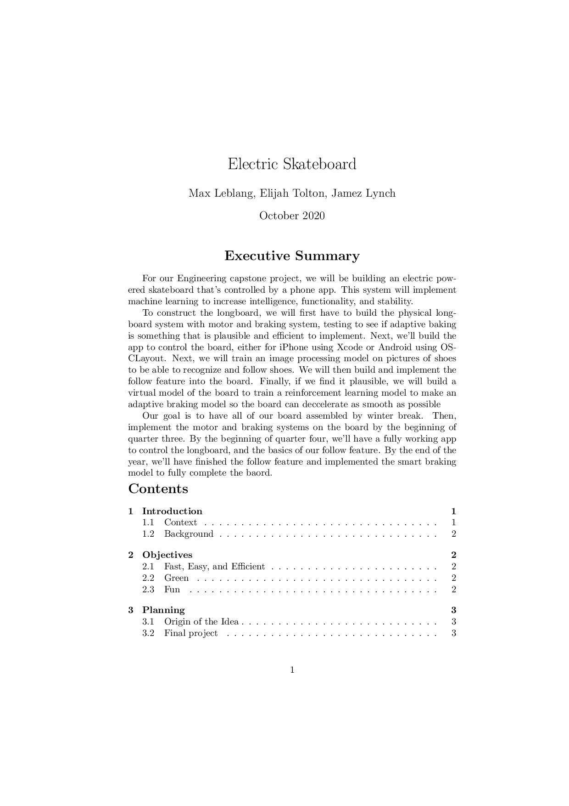
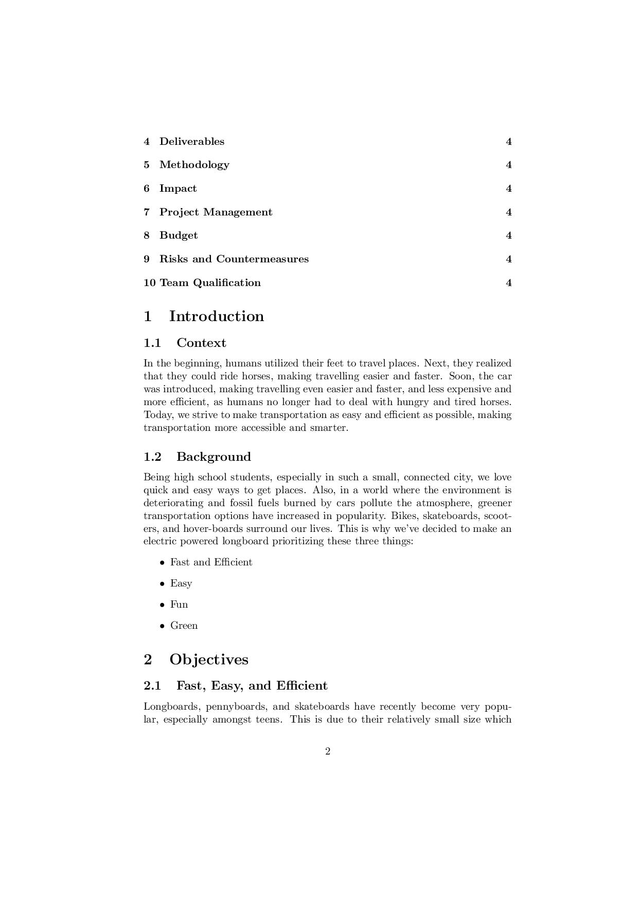
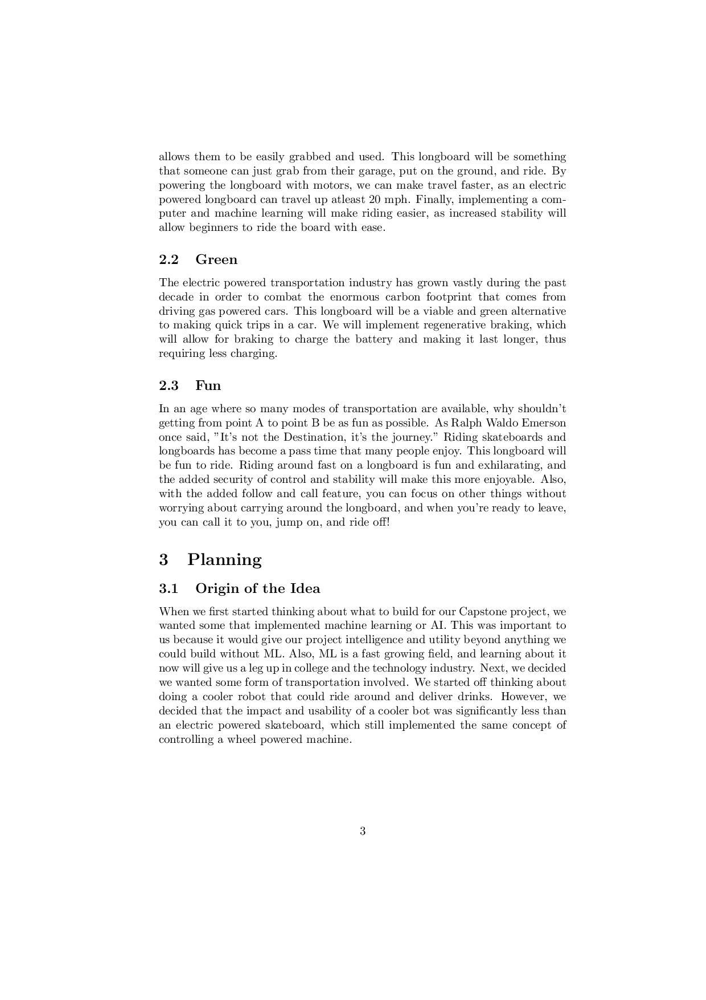
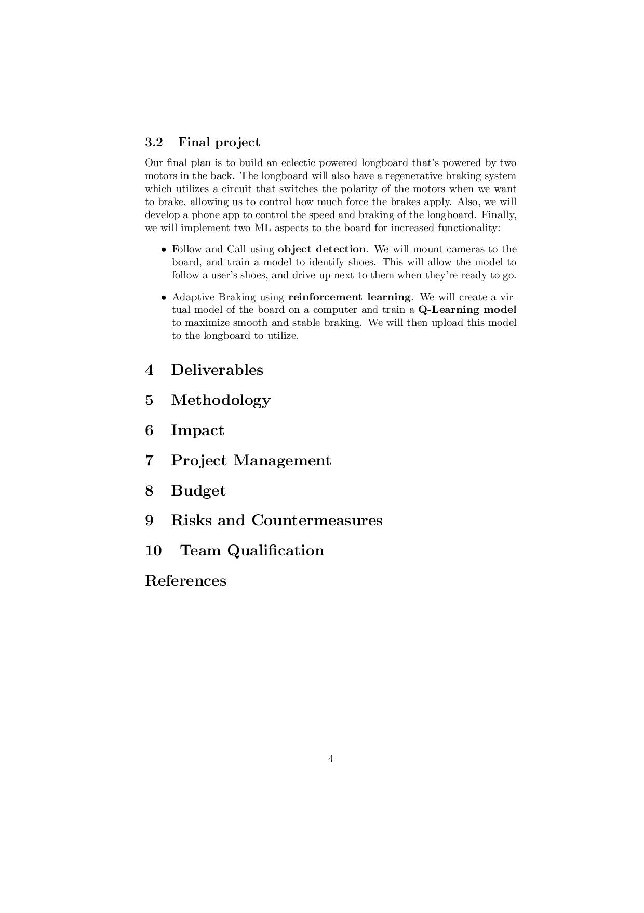

# Electric_longboard
Engineering Captsone project for Max, Jamez, and Elijah

Here is a link to the pdf of our proposal in LaTex so far:
[https://github.com/mleblan67/Electric_longboard/blob/main/Capstone_Proposal.pdf]

I haven't figured out the best way to embed a pdf into a README.md yet so below are the pages in jpg form:

