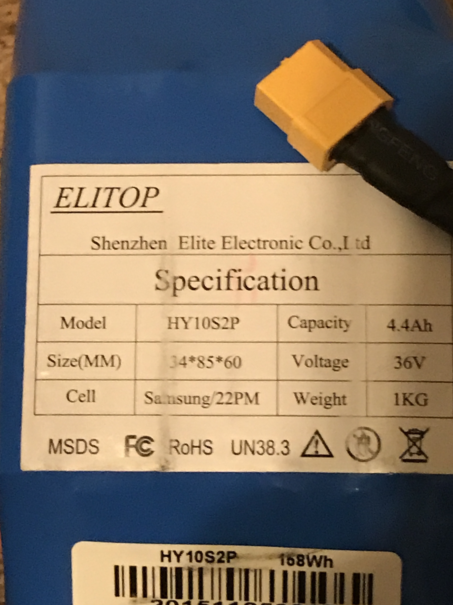

## Weekly Journal Entries

### Nov. 1-7
This week we still are manipulating/figuring out some of the basics of our project. After stripping down the components of an old hoverboard, we discovered that the battery used in that could potentially serve our purposes well. It is a 4400 mAh battery, capable of outputting 36V. This puts it well within the range we need for the motors we have researched. Additionally it already has a standard connection and charge cable connected to it which would make charging it and wiring it very simple and straight forward. This would remove a significant cost necessary to make our board while actually provided us with a higher quality battery than we most likely would've purchased to save costs. Also, this week we continued research into machine learning. While we still are a little lost, we found a lengthy Youtube video with in depth descriptions and walk-throughs into the basics of [Tensor Flow.](https://www.youtube.com/watch?v=tPYj3fFJGjk&feature=youtu.be) We plan on following along with this video in the next week or so to ensure that we have a basic understanding of tensor flow before we begin righting or algorithims for learning.

### Nov. 8-14

### Nov. 15-21

### Nov. 22-28

### Nov. 29 - Dec. 5
